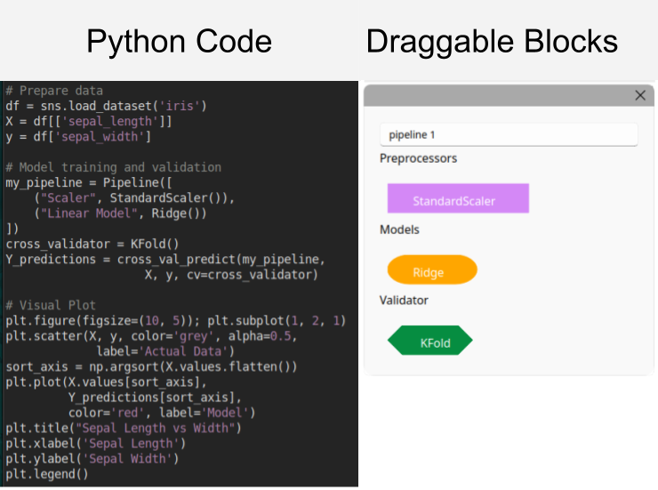
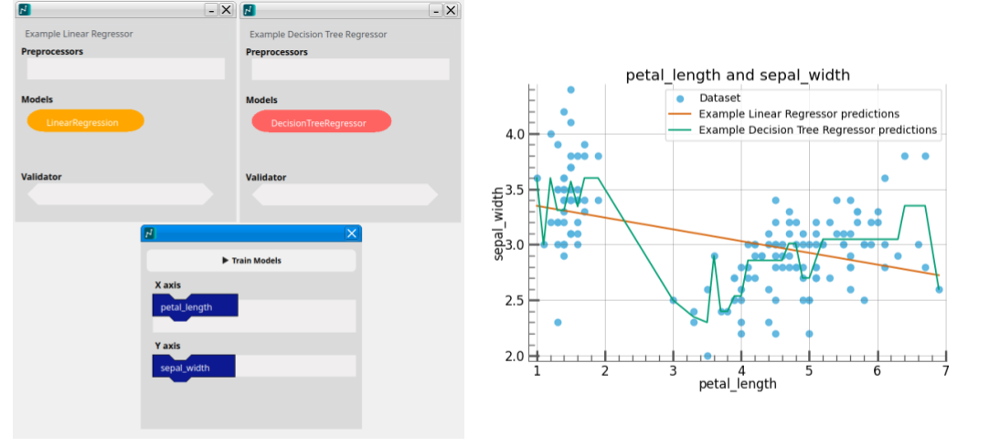
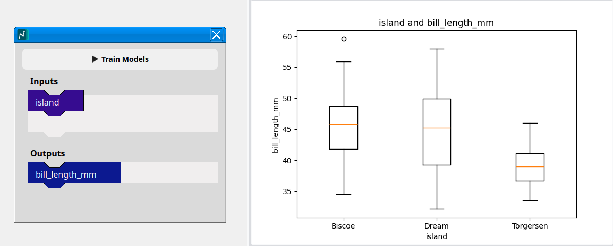
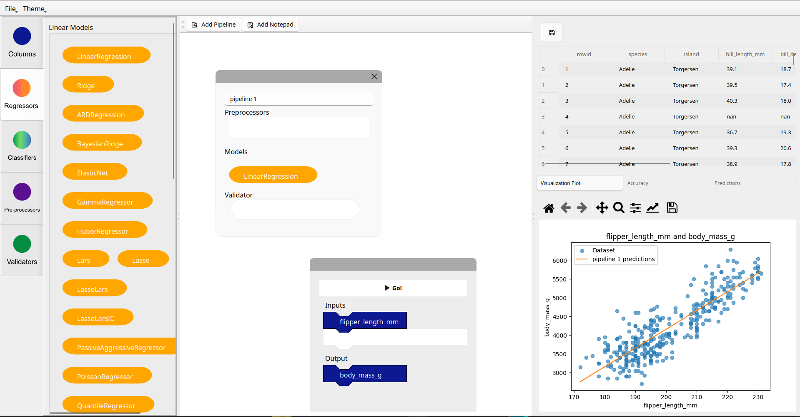
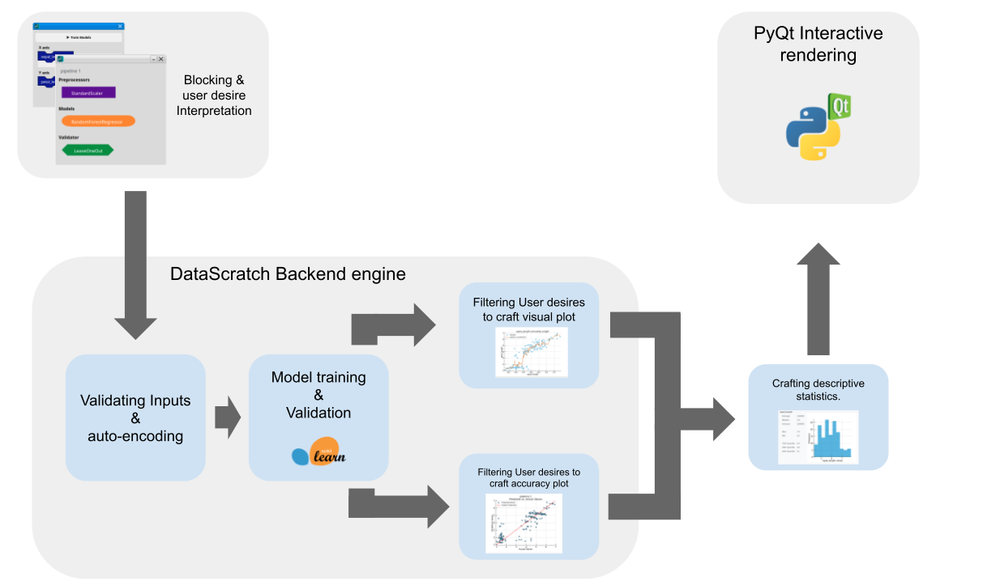

<!--
Important Notes: 
    Length : 750 words - 1,750 words

-->

# Summary

Machine learning is often taught at the upper undergraduate levels, with programming often cited as a prerequisite for learning Machine learning[@bart2016implementing;@thayer2020practical;@brunner2016teaching]. This creates an barrier to entry that bars some novices, who want to learn Machine learning, but are unable to do so due to a lack of programming knowledge. DataScratch aims to teach novices the core concepts of statistical machine learning through a intuitive drag and drop interface inspired by scratch[@resnick2009scratch].

# Statement of need

## Programming as a barrier to machine learning
Many educators cite that programming is a barrier to entry to machine learning [@bart2016implementing;@thayer2020practical;@brunner2016teaching]. This is because many tools and libraries for machine learning are called programmatically. CLT(Cognitive Load Theory) often cites that learning prerequisites is nessicary for mastering new an complex topics [@bransford1972contextual]. The cognitive load associated with learning both programming syntax and complex statistical concepts associated with machine learning simultaneously can be too much on students. 

## Machine learning literacy
This lack of accessible entry points limits the potential for widespread machine learning literacy. As AI increasingly permeates various aspects of modern life understanding its underlying principles becomes essential.  AI literacy empowers individuals to critically evaluate these systems, fostering informed decision-making and promoting responsible technological development[@provost2013data;@jain2021smart]. Moreover, a basic grasp of AI models can demystify complex technologies, enabling students to navigate a world shaped by intelligent systems with greater confidence and agency.[@hsu2025effects]

Therefore, there's an urgent need for tools that prioritize accessibility and intuitive learning. A low barrier to entry is paramount; users should be able to explore core data science concepts without needing prior programming experience. This necessitates a paradigm shift away from code-centric approaches towards user-friendly interfaces that abstract the complexities of programming while preserving the fundamental principles of data analysis.

# State of the field

There are several no-code, low code platforms available on the internet. However these are often designed with power users in mind, and are often expensive, making them frustrating to novices. Many of these softwares are geared toward commercial data science use, with a focus on integration with common business tools. 

| Name        | Description                | Target Audience | License              | Drag and drop |
|-------------|----------------------------|-----------------|----------------------|---------------|
| DataBricks  | Generative AI              | Businesses     | Paid / Commercial    | No            |
| Power BI    | Visualization Interface    | Businesses     | Paid / Commercial    | Yes           |
| Rapid Miner | Training / Visualization   | Data Scientists | Free for individuals | No            |
| JASP        | Statistics / Visualization | Upper Undergraduate / Graduate        | Free                 | No            |

The platforms that are free and tailored to students, such as JASP[@JASP2025] is catered to teaching students statistics, rather than expressly teaching them machine learning. 

# Software design

## Inspiration
Scratch[@resnick2009scratch], a visual programming language designed for children, offers a compelling model for accessible computational learning. Its intuitive drag-and-drop interface allows beginners to grasp fundamental programming concepts without needing to decipher complex syntax. Scratch's interface has been proven to be effective at teaching novices programming concepts, and assist learners when the transition to "real" programming[@armoni2015scratch].

## Drag and drop design
The drag and drop interface is designed to reduce the syntactic complexity of programming down to drag and drop blocks, with the layout and design imitating underlying python libraries. This ensures that users have an low floor to learning, while also paving the way for them to transition to writing code later. 

Each drag and drop block is modeled after basic shapes, this gives the user visual signifier, indicating where each block should be dropped on the interface. This ensures the interface is intuitive to people without machine learning experience. 

Training multiple models at once is a core feature, allowing for quick model comparison. This enables common user desires within data science, where data scientists often compare and contrast models. Another purpose of this feature is to allow users to learn the differences between certain models. 

Users are also enabled to perform basic statistical analysis, this can be done by removing all of the pipeline blocks, and only plotting via the "Inputs and Outputs" block. The software also automatically runs a descriptive statistics plotting on all columns inputted, whenever a model training job is submitted. 

The interface also allows the user to input manual predictions, allowing for novices to interact with their newly created AI models. This tab enables the user to export their saved models as software, which is where a user can save their trained model, and access it later. DataScratch also enables the exporting as pickle, which fulfills the needs of potential power users, by allowing them to interface with the python object directly, if desired.

## Built in Educational Materials

Datascratch comes pre-loaded with several example datasets, which have been crafted to be usable to a wide range of users, allowing novices to get learning right away, without having to procure a dataset first. These datasets are a blend of commonly used data science teaching datasets such as palmers_penguins[@palmerpenguins], diamonds dataset[@Waskom2021] and the iris dataset[@iris_53], as well as datasets that would be enticing to a younger audience, such as a dataset containing information about pokemon[@KagglePokemon] and a dataset about minecraft biome statistics[@KaggleMinecraft].  

## Software architecture and core project libraries
The language for this software is python, this is because python possesses several libraries, such as pandas[@reback2020pandas], matplotlib[@Hunter:2007], and scikit-learn[@scikit-learn;], which are standard tools for teaching machine learning[@burridge2022teaching]. 

The core machine learning models are provided by scikit-learn[@scikit-learn;]. There are several reasons for choosing scikit-learn, one of them is portability. scikit-learn is very common within the entry level machine learning field, so this means that skills that novice learn from DataScratch could translate easily to programmatic skills, if the novice decides to learn programming. Additionally, the scikit-learn is very friendly for first time users, featuring extensive documentation, which can be viewed by hovering on each items tooltip. Pandas[@reback2020pandas] is used for handling the data, this is because pandas supports the importing of multiple standard filetype formats, such as csv, excel, and parquet. Matplotlib is utilized for the plotting features, this is because matplotlib interfaces well with the PyQt background, as well as being another standard data science library. 

A built in feature is the automatic encoding of strings as classes, the purpose of this is to simplify the user experience. This means that 

{...More here...}

# Research impact statement

There is an need for open source AI learning, and the democratization of AI literacy[@prinsloo2024democratisation], in a world rapidly being shaped by AI. DataScratch offers a way for students to learn more about the core concepts of AI and data science, while maintaining a high interactivity. 

The current codebase also supports the automatic building of installers for both windows and linux. In linux, this is in the form of a debian package, and for windows, it is the form of a executable. This shows near term significance in the form of reproducible materials.

# AI usage disclosure
~95% of this project was written by humans, and ~5% would be what is consider "AI assisted". Google was used to search for API documentation. The built in AI overview on google cannot be deactivated, and thus the AI overview was used upon each google search. Oftentimes, the google AI overview provided false information, and was ignored in the later stages of the project due to a lack of verifiability. Generative AI was later used during the proofreading stage of writing the paper, with it helping catch several grammatical errors. 

# References