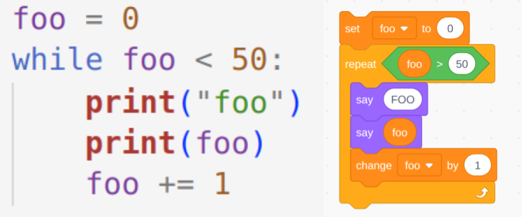
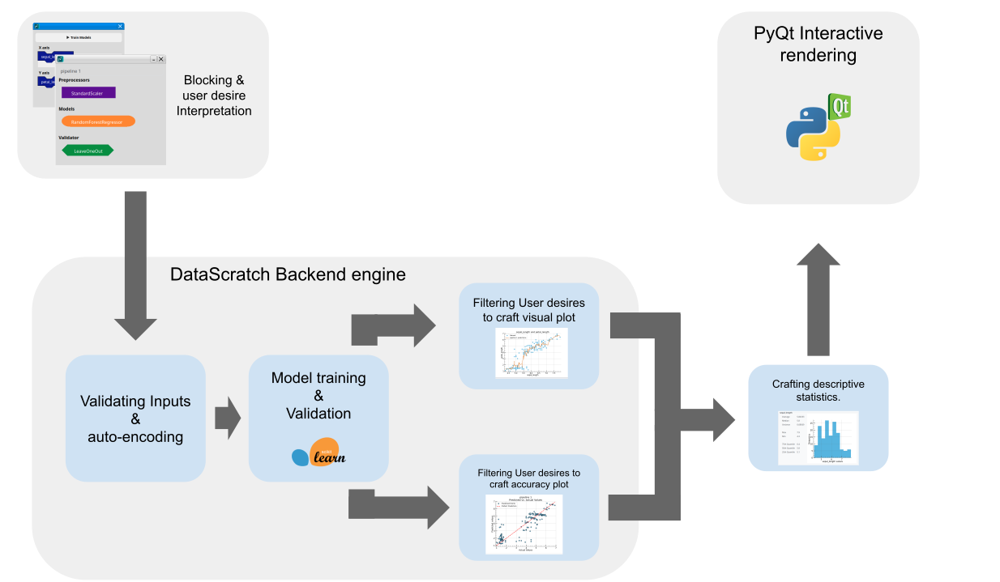

## Background & Inspiration

Invented in 2003 scratch is a programming language intended for children ages 10 - 15. The intent of this project was to model programming concepts via large colorful blocks, to teach children the basics of programming. Scratch has since been a massive success, as of 2023 scratch go 95 million monthly visits, some fo those recurring users, other programming novices. 

This language was intended to model real world programming, whilst giving children a streamlined experience, free of the frustrating nature of learning to code. 

*Side by side comparison of scratch versus python*

Upon it's initial completion scratch had two defining features.
1. **Drag and Drop Blocks** Scratch is programmed through drag and drop blocks, allowing for novices to learn in a more intuitive way. As well as preventing students from copying and pasting answers, ensuring that their exploration and interaction with the material remains exploratory. 
2. **Examples** Scratch comes preloaded with examples and tutorials, leading to a more streamlined experience.    


# Summary

Machine learning is often taught at the upper undergraduate levels, with programming often cited as a prerequisite for learning Machine learning[@bart2016implementing;@thayer2020practical;@brunner2016teaching]. This creates an barrier to entry that bars some novices, who want to learn Machine learning, but are unable to do so due to a lack of programming knowledge. DataScratch aims to teach novices the core concepts of statistical machine learning through a intuitive drag and drop interface inspired by scratch[@resnick2009scratch].


# Statement of need

## Programming as a barrier to machine learning
Many educators cite that programming is a barrier to entry to machine learning [@bart2016implementing;@thayer2020practical;@brunner2016teaching]. This is because many tools and libraries for machine learning are called programmatically. 

CLT(Cognitive Load Theory) often cites that learning prerequisites is nessicary for mastering new an complex topics [@bransford1972contextual]. The cognitive load associated with learning both programming syntax and complex statistical concepts associated with machine learning simultaneously can be too much on students[CITATION]. 

## Machine learning literacy
This lack of accessible entry points limits the potential for widespread machine learning literacy. As AI increasingly permeates various aspects of modern life understanding its underlying principles becomes essential.  e literacy empowers individuals to critically evaluate these systems, fostering informed decision-making and promoting responsible technological development[@provost2013data;@jain2021smart]. Moreover, a basic grasp of AI models can demystify complex technologies, enabling students to navigate a world shaped by intelligent systems with greater confidence and agency.[@hsu2025effects]

Therefore, there's an urgent need for tools that prioritize accessibility and intuitive learning. A low barrier to entry is paramount; users should be able to explore core data science concepts without needing prior programming experience. This necessitates a paradigm shift away from code-centric approaches towards user-friendly interfaces that abstract the complexities of programming while preserving the fundamental principles of data analysis.

# State of the field

There are several no-code, low code platforms available on the internet. However these are often designed with power users in mind, and are often expensive, making them frustrating to novices. Many of these softwares are geared toward commercial data science use, with a focus on integration with common business tools. 

| Name        | Description                | Target Audience | License              | Drag and drop |
|-------------|----------------------------|-----------------|----------------------|---------------|
| DataBricks  | Generative AI              | Businesses     | Paid / Commercial    | No            |
| Power BI    | Visualization Interface    | Businesses     | Paid / Commercial    | Yes           |
| Rapid Miner | Training / Visualization   | Data Scientists | Free for individuals | No            |
| JASP        | Statistics / Visualization | Upper Undergraduate / Graduate        | Free                 | No            |

The platforms that are free and tailored to students, such as JASP[@JASP2025] is catered to teaching students statistics, rather than expressly teaching them machine learning. 

# Software design

## Inspiration
Scratch[@resnick2009scratch], a visual programming language designed for children, offers a compelling model for accessible computational learning. Its intuitive drag-and-drop interface allows beginners to grasp fundamental programming concepts without needing to decipher complex syntax. Scratch's interface has been proven to be effective at teaching novices programming concepts, and assist learners when the transition to "real" programming[@armoni2015scratch].

To be clear. DataScratch is not intended to be a replacement for machine learning programming, but rather to give novices an introduction to machine learning. The goals of the project are similar to Scratch in this aspect. 

## Language and core project libaries
The language for this software is python, this is because python possesses several libraries, such as pandas[@reback2020pandas], matplotlib[@Hunter:2007], and scikit-learn[@scikit-learn;sklearn_api], which are standard tools for machine learning. Another reason would be portability. If a user desires features that are beyond the scope of DataScratch, the software is built in a way the models and utilizes underlying data science libraries, to make the transition from using DataScratch to programming in python easier.



## History
The GUI software was originally written using a python library called PyGtk[@pygobject2025], however after several months of development this library was dropped, due to the PyGtk library having a non-functional pip installation, and graphical issues when run on windows. Additionally, electron was considered, with the benefit being easier styling, however it did not posses seamless python support. The project later switched to PyQt, which featured cross platform support, and allowed for installation via pip by default. 

## Drag and drop design
The drag and drop interface is designed to be easy to use, with the layout and design imitating underlying python libraries. This ensures that users have an low floor to learning, while also paving the way for them to transition to writing code later.  


The interface also enables the user to assemble and train multiple models at once, allowing for quick model comparison. This enables common user desires within data science, where data scientists often compare and contrast models. Another purpose of this feature is to allow users to learn the differences between certain models. 


Additionally, Datascratch comes pre-loaded with several example datasets, which have been crafted to be usable to a wide range of users, allowing novices to get learning right away, without having to procure a dataset first. The interface also allows the user to input manual predictions, allowing for novices to interact with their newly created AI models. This tab enables the user to export their saved models as software, which is where a user can save their trained model, and access it later. DataScratch also enables the exporting as pickle, which fulfills the needs of potential power users, by allowing them to interface with the python object directly, if desired.


## Running the current GUI

Works on Linux , Windows. Has not been tested on Mac yet, however, I see no reason why it shouldn't work. 

Make a virtual environment (This is different for every platform)
```
python -m venv myenv
```
Then activate your virtual environment.
```
# Linux / Mac 
source ./myenv/bin/activate

# Windows (Command prompt)
call myenv\scripts\activate.bat


# Windows (Git Bash)
source myenv/Scripts/activate

```
Install the required dependencies.
```
pip install ".[dev]"
pip install -e .
pip install requirments.txt
```
Running the GUI (This may be slow the first time you run it).
```
datascratch
```
Running Unit tests
```
pytest --cov=..
```
## Installing from an installer

Windows and Linux are currently supported. They can be found in the `most_recent_installers` folder.

## Packaging
Packaging for linux.
```
./package_linux.sh
```


Packaging for windows
1. Install [InstallForge](https://installforge.net/)
```

```